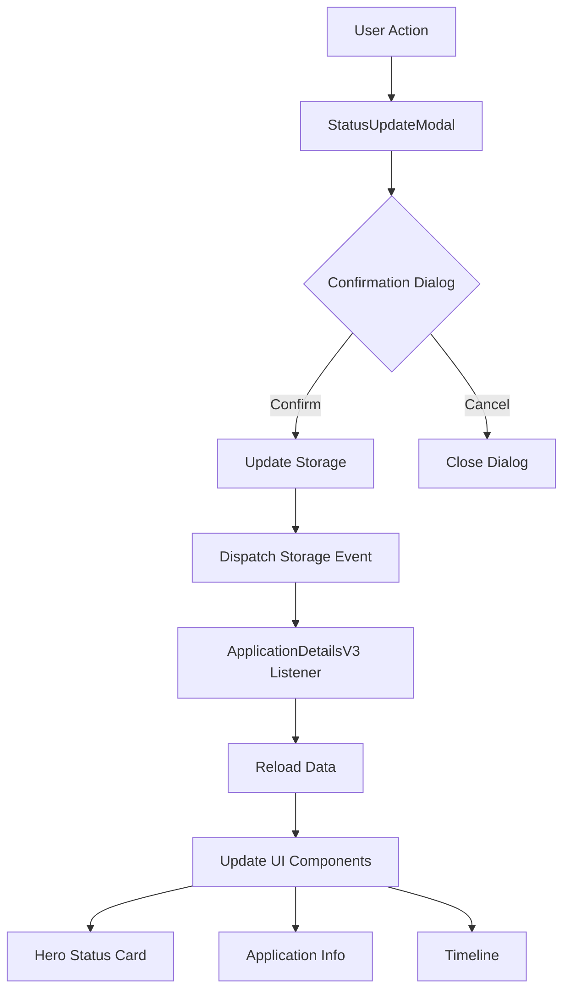

# Status Update System - Fix Implementation Plan
**Date:** December 25, 2024  
**Version:** 1.0  
**Status:** Ready for Implementation

---

## Executive Summary

This document outlines the comprehensive plan to fix critical issues in the UniBexs application status update system. The main problems include UI elements not updating after status changes, browser alerts being used instead of proper UI notifications, and lack of confirmation dialogs for critical actions.

---

## 1. Problem Analysis

### 1.1 Current Issues

#### Issue #1: UI Not Updating After Status Change
- **Symptom:** When a user updates an application status, the Hero Status Card and other UI elements don't reflect the change immediately
- **Root Cause:** Storage event key mismatch between components
- **Impact:** High - Users must refresh the page to see updates
- **Affected Files:**
  - `StatusUpdateModal.tsx`
  - `ApplicationDetailsV3.tsx`
  - `storage.ts`

#### Issue #2: Browser Alerts Instead of UI Notifications
- **Symptom:** Error and success messages appear as browser alert() popups
- **Root Cause:** Using JavaScript alert() instead of integrated UI components
- **Impact:** Medium - Poor user experience, unprofessional appearance
- **Locations:** 6 instances of alert() in StatusUpdateModal.tsx

#### Issue #3: No Confirmation Before Status Changes
- **Symptom:** Status changes happen immediately without user confirmation
- **Root Cause:** Missing confirmation step in the update flow
- **Impact:** Medium - Risk of accidental status changes
- **User Story:** "As an admin, I want to confirm critical status changes before they're applied"

### 1.2 Technical Root Causes

```
Current Flow (Broken):
1. User clicks "Update Status"
2. StatusUpdateModal updates localStorage
3. Dispatches StorageEvent with key: 'applications' ❌
4. ApplicationDetailsV3 listens for 'appleaction_applications' ❌
5. Event mismatch = No UI update
```

```
Expected Flow (Fixed):
1. User clicks "Update Status"
2. Show confirmation dialog
3. On confirm, update localStorage
4. Dispatch StorageEvent with key: 'appleaction_applications' ✅
5. ApplicationDetailsV3 catches event and reloads ✅
6. UI updates immediately
```

---

## 2. Solution Architecture

### 2.1 Component Interaction Diagram



### 2.2 Event Flow Specification

| Event Type | Key | Listener | Action |
|------------|-----|----------|--------|
| StorageEvent | 'appleaction_applications' | ApplicationDetailsV3 | Reload application data |
| CustomEvent | 'applicationUpdated' | ApplicationDetailsV3 | Update local state |
| CustomEvent | 'forceRefresh' | ApplicationDetailsV3 | Force complete reload |

---

## 3. Implementation Details

### 3.1 Fix Storage Event Keys

**File:** `src/components/workflow/StatusUpdateModal.tsx`

**Current Code (WRONG):**
```javascript
window.dispatchEvent(new StorageEvent('storage', {
  key: 'applications',  // ❌ Wrong key
  newValue: JSON.stringify(StorageService.getApplications()),
}));
```

**Fixed Code (CORRECT):**
```javascript
window.dispatchEvent(new StorageEvent('storage', {
  key: 'appleaction_applications',  // ✅ Correct key matching STORAGE_KEYS.APPLICATIONS
  newValue: JSON.stringify(StorageService.getApplications()),
}));
```

**Locations to Fix:**
- Line 237: Document request handler
- Line 369: File upload handler  
- Line 533: Main status update handler

### 3.2 UI Notification System

**Component Structure:**
```typescript
interface Notification {
  type: 'success' | 'error' | 'warning' | 'info';
  message: string;
  duration?: number;  // Auto-dismiss after X ms
}

const [notification, setNotification] = useState<Notification | null>(null);
```

**Notification Component JSX:**
```jsx
{notification && (
  <div className={`
    fixed bottom-4 right-4 z-50 max-w-md p-4 rounded-lg shadow-lg
    transform transition-all duration-300 ease-in-out
    ${notification.type === 'success' ? 'bg-green-100 border-green-400 text-green-800' :
      notification.type === 'error' ? 'bg-red-100 border-red-400 text-red-800' :
      notification.type === 'warning' ? 'bg-yellow-100 border-yellow-400 text-yellow-800' :
      'bg-blue-100 border-blue-400 text-blue-800'}
  `}>
    <div className="flex items-start">
      <div className="flex-shrink-0">
        {notification.type === 'success' && <CheckCircle className="w-5 h-5" />}
        {notification.type === 'error' && <XCircle className="w-5 h-5" />}
        {notification.type === 'warning' && <AlertTriangle className="w-5 h-5" />}
        {notification.type === 'info' && <Info className="w-5 h-5" />}
      </div>
      <div className="ml-3 flex-1">
        <p className="text-sm font-medium">{notification.message}</p>
      </div>
      <button 
        onClick={() => setNotification(null)}
        className="ml-4 flex-shrink-0"
      >
        <X className="w-4 h-4" />
      </button>
    </div>
  </div>
)}
```

**Replace Alert Calls:**

| Current | Replacement |
|---------|-------------|
| `alert('Please provide a reason for this status change.');` | `setNotification({ type: 'error', message: 'Please provide a reason for this status change.' });` |
| `alert('Failed to update application status.');` | `setNotification({ type: 'error', message: 'Failed to update application status. Please try again.' });` |
| `alert('Status updated successfully!');` | `setNotification({ type: 'success', message: 'Status updated successfully!' });` |

### 3.3 Confirmation Dialog Implementation

**State Management:**
```typescript
const [showConfirmation, setShowConfirmation] = useState(false);
const [pendingUpdate, setPendingUpdate] = useState<{
  status: string;
  reason: string;
  notes: string;
} | null>(null);
```

**Confirmation Modal Component:**
```jsx
{showConfirmation && pendingUpdate && (
  <div className="fixed inset-0 z-[60] overflow-y-auto">
    <div className="flex min-h-screen items-center justify-center p-4">
      {/* Backdrop */}
      <div 
        className="fixed inset-0 bg-gray-900/80 backdrop-blur-sm"
        onClick={() => setShowConfirmation(false)}
      />
      
      {/* Modal */}
      <div className="relative bg-white dark:bg-gray-800 rounded-xl shadow-2xl max-w-md w-full p-6">
        <h3 className="text-lg font-semibold text-gray-900 dark:text-gray-100 mb-4">
          Confirm Status Change
        </h3>
        
        <div className="space-y-3 mb-6">
          <div className="bg-gray-50 dark:bg-gray-900 rounded-lg p-3">
            <p className="text-sm text-gray-600 dark:text-gray-400">Current Status:</p>
            <p className="font-medium text-gray-900 dark:text-gray-100">
              {application.currentStatus.replace(/_/g, ' ')}
            </p>
          </div>
          
          <div className="bg-blue-50 dark:bg-blue-900/20 rounded-lg p-3">
            <p className="text-sm text-blue-600 dark:text-blue-400">New Status:</p>
            <p className="font-medium text-blue-900 dark:text-blue-100">
              {pendingUpdate.status.replace(/_/g, ' ')}
            </p>
          </div>
          
          {pendingUpdate.reason && (
            <div className="bg-yellow-50 dark:bg-yellow-900/20 rounded-lg p-3">
              <p className="text-sm text-yellow-600 dark:text-yellow-400">Reason:</p>
              <p className="text-sm text-gray-700 dark:text-gray-300">{pendingUpdate.reason}</p>
            </div>
          )}
        </div>
        
        <div className="flex justify-end space-x-3">
          <button
            onClick={() => {
              setShowConfirmation(false);
              setPendingUpdate(null);
            }}
            className="px-4 py-2 border border-gray-300 dark:border-gray-600 rounded-lg text-gray-700 dark:text-gray-300 hover:bg-gray-50 dark:hover:bg-gray-700"
          >
            Cancel
          </button>
          <button
            onClick={confirmStatusUpdate}
            className="px-4 py-2 bg-blue-600 text-white rounded-lg hover:bg-blue-700"
          >
            Confirm Update
          </button>
        </div>
      </div>
    </div>
  </div>
)}
```

### 3.4 ApplicationDetailsV3 Event Listener Fixes

**File:** `src/components/applications/ApplicationDetailsV3.tsx`

**Current Code (BROKEN):**
```javascript
const handleStorageChange = (e: StorageEvent) => {
  if (e.key?.includes('application_') || e.key?.includes('appleaction_')) {
    loadApplicationData();
  }
};
```

**Fixed Code:**
```javascript
const handleStorageChange = (e: StorageEvent) => {
  // Specifically check for the applications key
  if (e.key === 'appleaction_applications') {
    console.log('[ApplicationDetailsV3] Storage changed, reloading application data');
    
    // Get the specific application from the updated data
    const updatedApplications = JSON.parse(e.newValue || '[]');
    const updatedApp = updatedApplications.find((app: Application) => app.id === application?.id);
    
    if (updatedApp) {
      // Update local state immediately
      setApplication(updatedApp);
      // Then reload for related data
      loadApplicationData();
    }
  }
};
```

---

## 4. Testing Plan

### 4.1 Test Scenarios

| Test Case | Steps | Expected Result |
|-----------|-------|-----------------|
| **TC1: Status Update Reflects Immediately** | 1. Open application details<br>2. Click "Update Status"<br>3. Select new status<br>4. Confirm update | Hero Status Card updates immediately without page refresh |
| **TC2: Confirmation Dialog Works** | 1. Click "Update Status"<br>2. Select status<br>3. Click Submit<br>4. See confirmation<br>5. Click Cancel | Status change is cancelled, modal closes |
| **TC3: UI Notifications Display** | 1. Update status without reason<br>2. See error notification<br>3. Add reason and submit<br>4. See success notification | Notifications appear in UI, not as browser alerts |
| **TC4: Multiple Browser Tabs Sync** | 1. Open same application in 2 tabs<br>2. Update status in tab 1<br>3. Check tab 2 | Tab 2 automatically updates without refresh |

### 4.2 Browser Compatibility

Test on:
- Chrome (latest)
- Firefox (latest)
- Safari (latest)
- Edge (latest)

### 4.3 Performance Metrics

| Metric | Current | Target |
|--------|---------|--------|
| Status update latency | 3-5 seconds | < 500ms |
| UI refresh time | Manual refresh needed | Instant |
| Event propagation | Broken | < 100ms |

---

## 5. Implementation Timeline

### Phase 1: Core Fixes (Day 1 - 2 hours)
- [ ] Fix storage event keys (30 min)
- [ ] Fix ApplicationDetailsV3 listeners (30 min)
- [ ] Test basic functionality (30 min)
- [ ] Debug any issues (30 min)

### Phase 2: UI Improvements (Day 1 - 3 hours)
- [ ] Implement notification component (1 hour)
- [ ] Replace all alert() calls (30 min)
- [ ] Add confirmation dialog (1 hour)
- [ ] Style and polish (30 min)

### Phase 3: Testing & Refinement (Day 2 - 2 hours)
- [ ] Complete test scenarios (1 hour)
- [ ] Fix any bugs found (30 min)
- [ ] Performance optimization (30 min)

**Total Estimated Time:** 7 hours

---

## 6. Code Examples

### 6.1 Complete Status Update Flow

```typescript
// Step 1: User initiates update
const handleSubmit = () => {
  // Validation
  if (!selectedStatus) {
    setNotification({ 
      type: 'error', 
      message: 'Please select a status' 
    });
    return;
  }
  
  // Show confirmation
  setPendingUpdate({
    status: selectedStatus,
    reason: reason,
    notes: notes
  });
  setShowConfirmation(true);
};

// Step 2: User confirms
const confirmStatusUpdate = async () => {
  try {
    setIsSubmitting(true);
    
    // Update application
    const updatedApp = {
      ...application,
      currentStatus: pendingUpdate.status,
      updatedAt: new Date().toISOString()
    };
    
    // Save to storage
    StorageService.updateApplication(updatedApp);
    
    // Trigger events
    window.dispatchEvent(new StorageEvent('storage', {
      key: 'appleaction_applications',
      newValue: JSON.stringify(StorageService.getApplications())
    }));
    
    // Show success
    setNotification({
      type: 'success',
      message: 'Status updated successfully!'
    });
    
    // Clean up
    setShowConfirmation(false);
    setPendingUpdate(null);
    onClose();
    
  } catch (error) {
    setNotification({
      type: 'error',
      message: 'Failed to update status. Please try again.'
    });
  } finally {
    setIsSubmitting(false);
  }
};
```

### 6.2 Auto-dismiss Notifications

```typescript
useEffect(() => {
  if (notification && notification.duration) {
    const timer = setTimeout(() => {
      setNotification(null);
    }, notification.duration);
    
    return () => clearTimeout(timer);
  }
}, [notification]);

// Usage
setNotification({
  type: 'success',
  message: 'Status updated!',
  duration: 3000  // Auto-dismiss after 3 seconds
});
```

---

## 7. Migration Strategy

### 7.1 Backward Compatibility
- Keep both event keys temporarily
- Log warnings for deprecated patterns
- Remove old code after 2 weeks

### 7.2 Feature Flags (Optional)
```typescript
const FEATURES = {
  USE_CONFIRMATION_DIALOG: true,
  USE_UI_NOTIFICATIONS: true,
  USE_NEW_EVENT_SYSTEM: true
};
```

---

## 8. Monitoring & Debugging

### 8.1 Debug Logging
Add comprehensive logging:
```typescript
const DEBUG = process.env.NODE_ENV === 'development';

if (DEBUG) {
  console.log('[StatusUpdate] Dispatching event:', {
    key: 'appleaction_applications',
    applicationId: updatedApp.id,
    newStatus: updatedApp.currentStatus
  });
}
```

### 8.2 Error Tracking
```typescript
window.addEventListener('error', (event) => {
  if (event.error?.message?.includes('storage')) {
    console.error('[Storage Error]', event.error);
    // Send to error tracking service
  }
});
```

---

## 9. Success Criteria

✅ **Immediate UI Updates**
- Status changes reflect within 500ms
- No page refresh required
- All UI components update simultaneously

✅ **Professional Notifications**
- No browser alerts
- Consistent UI notifications
- Auto-dismiss option
- Accessible (ARIA labels)

✅ **Safe Status Changes**
- Confirmation required for all changes
- Clear visual feedback
- Cancel option available
- Reason required for rejections

✅ **Developer Experience**
- Clear error messages
- Comprehensive logging
- Easy to debug
- Well-documented code

---

## 10. Appendix

### A. File List
```
src/
├── components/
│   ├── workflow/
│   │   └── StatusUpdateModal.tsx (Primary changes)
│   └── applications/
│       └── ApplicationDetailsV3.tsx (Event listener fixes)
├── lib/
│   └── data/
│       └── storage.ts (Optional enhancements)
└── types/
    └── index.ts (Notification types)
```

### B. Dependencies
No new dependencies required. Uses existing:
- React (hooks for state)
- Tailwind CSS (styling)
- Lucide React (icons)

### C. References
- [Storage Event MDN](https://developer.mozilla.org/en-US/docs/Web/API/StorageEvent)
- [Custom Events MDN](https://developer.mozilla.org/en-US/docs/Web/API/CustomEvent)
- [React Event Handling](https://react.dev/learn/responding-to-events)

---

## Document Control

| Version | Date | Author | Changes |
|---------|------|--------|---------|
| 1.0 | Dec 25, 2024 | Claude | Initial comprehensive plan |

---

**END OF DOCUMENT**